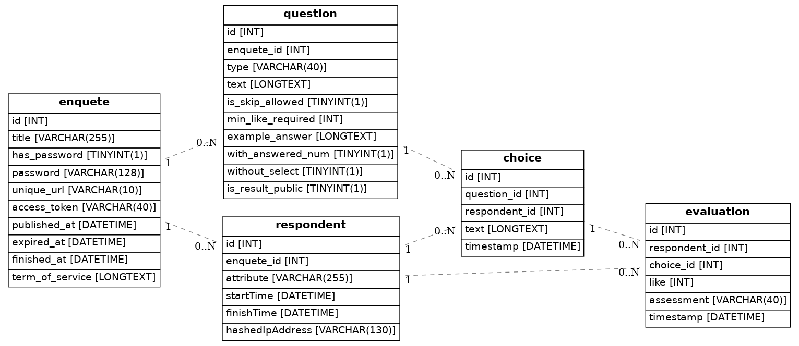

# データベーススキーマ

## enquete (アンケート)

| 論理項目名 | 物理名 | 型 | サイズ | NULL | 初期値 | 説明 |
|---|---|:---:|:---:|:---:|:---:|---|
| ID | id | INT | - | NOT NULL | - | - |
| アンケートタイトル | title | VARCHAR | 255 | NOT NULL | - | - |
| パスワードを利用するか | has_password | TINYINT | 1 | NOTNULL | 0 | - |
| 共通パスワード | password | VARCHAR | 128 | NULLABLE | - | - |
| 固有URLの文字列 | unique_url | VARCHAR | 10 | NOT NULL | - | URLに用いる一意の文字列 |
| アクセストークン | access_token | VARCHAR | 40 | NOT NULL | - | Dashboardへのログイン時に使用 |
| 公開開始日 | published_at | DATETIME | - | NOT NULL | - | - |
| 回答期限日 | expired_at | DATETIME | - | NULLABLE | - | - | 
| 公開終了日 | finished_at | DATETIME | - | NULLABLE | - | 現在の用法ではexpired_atのみで問題ないためexpired_atと同じ値が格納される |
| 利用規約 | term_of_service | LONGTEXT | - | NOT NULL | - | 利用規約として表示される文字列 |

## question (設問)

| 論理項目名 | 物理名 | 型 | サイズ | NULL | 初期値 | 説明 |
|---|---|:---:|:---:|:---:|:---:|---|
| ID | id | INT | - | NOT NULL | - | - |
| アンケートID | enquete_id | INT | - | NOT NULL | - | 外部キー |
| 回答タイプ | type | VARCHAR | 40 | NOT NULL | - | 選択式・自由記述式などを指定(格納される文字列の種類は下記参照) |
| 設問文 | text | LONGTEXT | - | NOT NULL | - | - |
| スキップ可能か | is_skip_allowed | TINYINT | 1 | NOT NULL | 1 | この設問がスキップ可能な設問かを真偽値で持つ |
| 最低いいね数 | min_like_required | INT | - | NOT NULL | 0 | このいいね数に満たない場合、設問終了前にアラートを出す |
| 回答例 | example_answer | LONGTEXT | - | NULLABLE | - | 自由記述設問における回答例 |
| 回答数の表示 | with_answered_num | TINYINT | 1 | NOT NULL | 0 | 1（True）の場合、各選択肢に選んだ回答者数を表示する |
| 選択肢の表示 | without_select | TINYINT | 1 | NOT NULL | 0 | typeがquestion（自由記述）かつ1（True）の場合、過去の回答者の回答を表示しない |
| 回答結果の公開 | is_result_public | TINYINT | 1 | NOT NULL | 1 | 0の場合、webAPIでの取得時に非公開情報として扱う（userIDは必ず非公開） |

- typeに格納される文字列
    - userid
        - 回答者のID（学籍番号など）の入力欄
    - question
        - 自由記述形式の質問
    - single
        - 単一選択の質問(ボタン型)
    - multi
        - 複数選択の質問(ボタン型)

## choice (選択肢)

| 論理項目名 | 物理名 | 型 | サイズ | NULL | 初期値 | 説明 |
|---|---|:---:|:---:|:---:|:---:|---|
| ID | id | INT | - | NOT NULL | - | - |
| 設問ID | question_id | INT | - | NOT NULL | - | 外部キー |
| 回答者ID | respondent_id | INT | - | NULLABLE | - | 外部キー |
| 本文 | text | LONGTEXT | - | NOT NULL | - | - |
| タイムスタンプ | timestamp | DATETIME | - | NOT NULL | django.utils.timezone.now | 最初に作成された日時を記録 |

## respondent (回答者)

| 論理項目名 | 物理名 | 型 | サイズ | NULL | 初期値 | 説明 |
|---|---|:---:|:---:|:---:|:---:|---|
| ID | id | INT | - | NOT NULL | - | - |
| アンケートID | enquete_id | INT | - | NOT NULL | - | 外部キー |
| 属性 | attribute | VARCHAR | 255 | NULLABLE | - | 回答者を識別するID (学籍番号など) |
| 回答開始時間 | startTime | DATETIME | - | NULLABLE | - | - |
| 回答終了時間 | finishTime | DATETIME | - | NOT NULL | django.utils.timezone.now | 最初に作成された日時を記録 |
| ハッシュ化IPアドレス | hashedIpAddress | VARCHAR | 130 | NOT NULL | - | ハッシュ化されたIPアドレス |

## evaluation (評価)

| 論理項目名 | 物理名 | 型 | サイズ | NULL | 初期値 | 説明 |
|---|---|:---:|:---:|:---:|:---:|---|
| ID | id | INT | - | NOT NULL | - | - |
| 回答者ID | respondent_id | INT | - | NOT NULL | - | 外部キー |
| 選択肢ID | choice_id | INT | - | NOT NULL | - | 外部キー |
| いいね | like | INT | - | NOT NULL | - | 回答者の選択肢に対する評価 |
| 回答者の反応 | assessment | VARCHAR | 40 | NOT NULL | - | 表示された選択肢に対する回答者の反応（種類は下記参照） |
| タイムスタンプ | timestamp | DATETIME | - | NOT NULL | django.utils.timezone.now | 評価が作成された日時を記録 |

- assessmentに格納される文字列
  - like
    - 表示された上でいいねした
  - presented
    - 表示されたがいいねしなかった
  - dislike
    - 表示された上で反対の意思を示した（将来使用される予定）

## ER図

